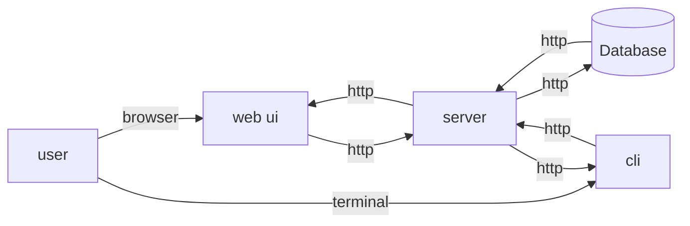

# go chat app and cli

## overview

this application serves as an example and a learning bed for my knowledge. i'm building this in the hopes it can help other developers learn something. all of the things i build, i must understand intrinsically, and to that end i carefully and intentionally do _each_ step. i want to capture those learnings for myself, and hopefully you the reader.

## layout

the application is setup as a mono-repo. a mono-repo has some distinct advantages for an org and a user. the ability to grok the entire app, as well as intrinsic prevention of library drift leads to a killer one two punch of maintainability and traceability. there's more we can go into, and i will at some more appropriate point.

as a high level overview:



in english:

- there are two UIs for the backend
- one is web
- one is cli
- both talk to the server via http
- server communicates with a db
- responses are sent back

## plan

see [ROADMAP.md](./ROADMAP.md)

## getting started

this is a hybrid project in a monorepo. using yarn 3 we are adding a series of util from the npm ecosystem to lubricate and improve the go dev experience.

### init

```
$ yarn
```

### development

```
$ yarn dev
```

navigate to [localhost:3000](http://localhost:3000), make changes in the fe or be, it will reload and run as needed!
